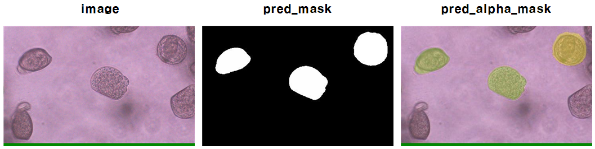

# U-Net: Semantic segmentation with PyTorch
<a href="#"></a>
<a href="https://pytorch.org/"></a>
<a href="#"></a>
<a href="#"></a>


## 이매패류 종자 이미지에서 이미지 마스킹 를 위한 PyTorch의 U-net 구현 모델




> ## Directory

### Root

${ROOT}는 다음과 같이 설명되어 있습니다.

```
${ROOT}  
|-- checkpoints
|-- dockerflie
|-- Dataset
|-- predict_save
|-- interrupted
|-- model
|-- utils
|-- wandb
|-- evaluate.py
|-- hubconf.py
|-- predict.py
|-- test.py
|-- train.py
|-- LICENSE
```

* `checkpoints` : 학습된 가중치파일(.pth) 들을 저장하는 디렉토리 
* `dockerfile` : docker 이미지가 저장되어있는 디렉토리
* `Dataset` : 원본 이미지(.jpg)와 이미지에 맞는 각 어노테이션(.json)파일이 담겨있는 디렉토리
* `predict_save` : 학습된 가중치 파일에 이미지를 넣어 예측된 파일을 저장하는 디렉토리
* `interrupted` : 학습도중 작업을 중단한 시점으로 부터의 가중치영역을 저장해놓는 디렉토리
* `model` : Unet 모델 파일 디렉토리
* `utils` : 데이터 전처리, 성능 지표, output 이미지 기능을 담아둔 디렉토리
* `wandb` : 학습된 데이터에 성능 지표 및 학습 후 이미지 예측 값을 저장해놓은 log들을 모아놓은 디렉토리

### Dataset  

아래와 같이 데이터 세트의 디렉토리 구조를 따라야 합니다. 

```
${ROOT}  
|-- Dataset 
|   |-- FU 
|   |-- |-- Train
|   |-- |-- |-- EG
|   |-- |-- |-- |-- annotations
|   |-- |-- |-- |-- |-- FU_MS_400_EG_220701_1430_013 (33).json
|   |-- |-- |-- |-- images
|   |-- |-- |-- |-- |-- FU_MS_400_EG_220701_1430_013 (33).jpg
|   |-- |-- |-- LA
|   |-- |-- |-- |-- annotations
|   |-- |-- |-- |-- |-- FU_MS_400_LA_220702_1730_001 (44).json
|   |-- |-- |-- |-- images
|   |-- |-- |-- |-- |-- FU_MS_400_LA_220702_1730_001 (44).jpg
|   |-- |-- |-- SP
|   |-- |-- |-- |-- annotations
|   |-- |-- |-- |-- |-- FU_MS_400_LA_220702_1730_001 (45).json
|   |-- |-- |-- |-- images
|   |-- |-- |-- |-- |-- FU_MS_400_LA_220702_1730_001 (45).jpg
|   |-- |-- Validation
|   |-- |-- |-- EG
|   |-- |-- |-- |-- annotations
|   |-- |-- |-- |-- |-- FU_MS_400_EG_220701_1430_013 (34).json
|   |-- |-- |-- |-- images
|   |-- |-- |-- |-- |-- FU_MS_400_EG_220701_1430_013 (34).jpg
|   |-- |-- |-- LA
|   |-- |-- |-- |-- annotations
|   |-- |-- |-- |-- |-- FU_MS_400_LA_220702_1730_001 (47).json
|   |-- |-- |-- |-- images
|   |-- |-- |-- |-- |-- FU_MS_400_LA_220702_1730_001 (47).jpg
|   |-- |-- |-- SP
|   |-- |-- |-- |-- annotations
|   |-- |-- |-- |-- |-- FU_MS_400_LA_220702_1730_001 (48).json
|   |-- |-- |-- |-- images
|   |-- |-- |-- |-- |-- FU_MS_400_LA_220702_1730_001 (48).jpg
|   |-- MA 
|   |-- |-- Train
|   |-- |-- |-- EG
|   |-- |-- |-- |-- annotations
|   |-- |-- |-- |-- |-- MA_MS_400_EG_220707_0800_029 (2).json
|   |-- |-- |-- |-- images
|   |-- |-- |-- |-- |-- MA_MS_400_EG_220707_0800_029 (2).jpg
|   |-- |-- |-- LA
|   |-- |-- |-- |-- annotations
|   |-- |-- |-- |-- MA_MS_400_LA_220707_2028 (1).json
|   |-- |-- |-- images
|   |-- |-- |-- |-- MA_MS_400_LA_220707_2028 (1).jpg
|   |-- |-- |-- SP
|   |-- |-- |-- |-- annotations
|   |-- |-- |-- |-- |-- MA_MS_200_Sp_220722_1028 (10).json
|   |-- |-- |-- |-- images
|   |-- |-- |-- |-- |-- MA_MS_200_Sp_220722_1028 (10).jpg
|   |-- |-- Validation
|   |-- |-- |-- EG
|   |-- |-- |-- |-- annotations
|   |-- |-- |-- |-- |-- MA_MS_400_EG_220707_0800_029 (23).json
|   |-- |-- |-- |-- images
|   |-- |-- |-- |-- |-- MA_MS_400_EG_220707_0800_029 (23).jpg
|   |-- |-- |-- LA
|   |-- |-- |-- |-- annotations
|   |-- |-- |-- |-- MA_MS_400_LA_220707_2028 (11).json
|   |-- |-- |-- images
|   |-- |-- |-- |-- MA_MS_400_LA_220707_2028 (11).jpg
|   |-- |-- |-- SP
|   |-- |-- |-- |-- annotations
|   |-- |-- |-- |-- |-- MA_MS_200_Sp_220722_1028 (14).json
|   |-- |-- |-- |-- images
|   |-- |-- |-- |-- |-- MA_MS_200_Sp_220722_1028 (14).jpg
```

### Wandb(Output)  

다음과 같이 Wandb 폴더의 디렉토리 구조를 따라야 합니다.

```
${ROOT}  
|-- Wandb  
|   |-- latest-run  
|   |-- debug.log  
|   |-- debug-internal.log  
|   |-- run-20221121_142252-...
```

* `latest-run` 최근 학습된 가중치를 가지고 이미지 파일, 로그 등이 저장되는 디렉토리
* `debug.log`  학습 시작 시 일어나는 디버그 값과 학습 환경을 저장해놓은 파일
* `debug-internal.log` 상태를 관찰하며 학습중 진행되는 모든 디버깅 로그값과 환경을 저장해놓은 파일
* `run-20221121_142252-...` 각 가중치마다의 로그값, 학습환경, 이미지들을 저장해놓은 디렉토리

> ## 초기 설정

### With out Docker

1. [Install CUDA](https://developer.nvidia.com/cuda-downloads)
2. [Install PyTorch](https://pytorch.org/get-started/locally/)
3. Install dependencies

```sh
# 경로 : /Bivalve_UNet_master/dockerflie/requirements.txt
$ pip3 install -r requirements.txt
```

### With Docker

1. Dockerfile Build and image produce
```sh
# 경로 : /Bivalve_UNet_master/dockerflie 
$ sudo docker build --tag unet:latest .
```
2. Download and run the image
```sh
$ sudo docker run -it --shm-size=32g --gpus all -v /local경로/:/model/ dockerimage 명 /bin/bash
```

### Wandb 오프라인모드

학습 시 오프라인 모드 사용 (--wandb or -w)

```sh
$ python3 train.py -mt unet -d FU -g 0 -w offline
```

오프라인 학습 후 WandB 로그값 온라인으로 옮기는 방법

```sh
$ wandb sync wandb/offline_wandb_폴더이름
```


> ## 이매패류 종자 이미지 학습

### 1. Download the data 

```

```

### 2. run training

```sh
# FU training
$ python3 train.py --model_type unet --dataset_type FU --epochs 200 --batch-size 8 --learning-rate 0.0001

# MA training
$ python3 train.py --model_type unet --dataset_type MA --epochs 200 --batch-size 8 --learning-rate 0.0001
```
#####  train.py --help

- `--wandb_mode`, `-w` : Model type is disabled, online, dryrun, offline, run
- `--model_type`, `-mt` : Model type is uent, deeplab_v3_plus
- `--dataset_type`, `-d` : Dataset type is FU, MA
- `--gpus_type`, `-g`: gpus type is 0, 1, 2, 3, 4                
- `--epochs`, `-e` : Number of epochs
- `--batch-size`, `-b` : Batch size
- `--classes`, `-c` : Number of classes
- `--channels`, `-ch` : Number of channels
- `--learning-rate`, `-l` : Learning rate
- `--load`, `-f` : Load model from a .pth file
- `--scale`, `-s` : Downscaling factor of the images
- `--validation`, `-v` : Percent of the data that is used as validation (0-100)
- `--amp` : Use mixed precision
- `--bilinear` : Use bilinear upsampling
- `--transform`, `-t`  : Transform(horizontal, vertical, brightness, contrast) proportion of all classes

### 3. Test

```sh
# FU testing
$ python3 test.py --model_type unet --dataset_type FU -b 1 -f /checkpoints/FU_checkpoints/원하는 checkpoint

# MA testing
$ python3 test.py --model_type unet --dataset_type MA -b 1 -f /checkpoints/MA_checkpoints/원하는 checkpoint
```

 ##### test.py --help

- `--wandb_mode`,`-w`  : WandB Mode is disabled, online, dryrun, offline, run

- `--model_type`, `-mt` : Model type is unet, deeplab_v3_plus

- `--dataset_type`, `-d` : Dataset type is FU, MA

- `--batch-size`, `-b` : Batch size

- `--load`, `-f`: Load model from a .pth file

- `--scale`, `-s` : Scale factor for the input images

- `--bilinear` : Use bilinear upsampling

- `--classes`, `-c` : Number of classes

- `--channels`, `-ch` : Number of channels

### 4. predict

```sh
# FU predict
$ python3 predict.py --model_type unet --model ./checkpoint/FU/unet/원하는 checkprint 	--input ./'Test FU_image 경로'  --output FU

# MA predict
$ python3 predict.py --model_type unet --model ./checkpoint/MA/unet/원하는 checkprint 	--input ./'Test MA_image 경로'  --output MA
```
##### predict.py --help

- `--model_type`, `-mt` : Model type is unet, deeplab_v3_plus
- `--model`, `-m` : Specify the file in which the checkpoint is stored
- `--input`, `-i` : Filenames of images', required=True
- `--output`, `-o` : Dataset type is FU, MA
- `--mask-threshold`, `-t` : Minimum probability value to consider a mask pixel white
- `--scale`, `-s` :  Scale factor for the input images
- `--bilinear` : Use bilinear upsampling
- `--classes`, `-c` : Number of classes
- `--channels`, `-ch` : Number of channels
